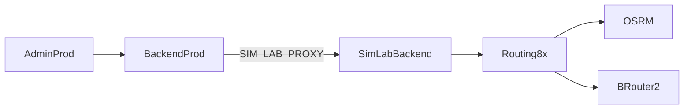

# Railway — prod sim capacity (peak / off-peak)


| | |
|--|--|
| **Status** | Active |
| **Owner role** | Platform Operator |
| **Last reviewed** | 2026-06-11 |
| **Audience** | Platform Operator |
| **lang** | pl |
| **canonical_path** | docs/pl/operations/RAILWAY_PROD_SIM_CAPACITY.md |

---

## Cel

Oszczędność RAM/kosztów na produkcji (`marvelous-gratitude`) przy zachowaniu pełnej symulacji w osobnym projekcie **4velo-sim-lab**.

| Środowisko | Rola |
|------------|------|
| **Prod** | Ruch użytkowników, anti-cheat (`brouter`), API, admin |
| **Sim-lab** | Batch 300k, live ramp 50k, routing×8, OSRM, `brouter-2` |

Symulacja z panelu admin prod idzie przez **proxy** (`SIM_LAB_PROXY_ENABLED=1`) — patrz [infrastructure/sim-lab/README.md](../../../infrastructure/sim-lab/README.md).

---

## Profile prod (ręczne przełączanie)

| Serwis | off-peak (domyślny) | peak (awaryjny prod-local) |
|--------|---------------------|----------------------------|
| `celery-worker-routing` | **0** replik | **2** repliki × 1 GB |
| `osrm` | **0** replik | **1** replika |
| `brouter-2` | **0** replik | **1** replika × 2 GB |
| `brouter` (primary) | **1** (bez zmian) | **1** (anti-cheat warstwa 3) |

**Nie skaluj w dół:** `Backend`, `celery-worker`, `Redis`, `TimescaleDB`, `telemetry`, `Admin`.

---

## Komendy

### Audyt stanu

```powershell
$env:RAILWAY_API_TOKEN = [Environment]::GetEnvironmentVariable('RAILWAY_API_TOKEN','User')
.\scripts\railway-audit-prod-simlab.ps1
```

### Off-peak (po zakończeniu testu / na co dzień)

```powershell
.\scripts\railway-set-prod-sim-capacity.ps1 -Profile off-peak
```

### Peak (tylko gdy musisz uruchomić symulację na prod DB — unikaj)

```powershell
.\scripts\railway-set-prod-sim-capacity.ps1 -Profile peak
```

Podgląd bez zmian:

```powershell
.\scripts\railway-set-prod-sim-capacity.ps1 -Profile off-peak -DryRun
```

---

## Przepływ load testu (zalecany)



1. Proxy (jednorazowo lub po rotacji secret):

   ```powershell
   $env:ADMIN_PASS = '<prod global_owner>'
   .\infrastructure\sim-lab\scripts\setup-sim-lab-proxy.ps1 -Redeploy
   ```

   Skrypt ustawia zmienne Railway **oraz** `POST /api/activities/admin/sim-data-plane/` → `target=sim-lab` (wyłącza `prod_local_writes` w Redis). Bez tego kroku `sim-target` może pokazywać `mode=prod-local-sim`.

2. Profil sim-lab:

   ```powershell
   .\infrastructure\sim-lab\scripts\sync-sim-lab-profile.ps1 -Profile 300k-50k -Redeploy
   .\infrastructure\sim-lab\scripts\scale-sim-lab-routing.ps1
   ```

3. Gotowość:

   ```powershell
   $env:ADMIN_PASS = '<sim-lab global_owner>'
   $env:PROD_ADMIN_PASS = '<prod global_owner>'  # opcjonalnie: weryfikacja proxy
   .\infrastructure\sim-lab\scripts\preflight-sim-lab-readiness.ps1
   ```

4. Prod off-peak:

   ```powershell
   .\scripts\railway-set-prod-sim-capacity.ps1 -Profile off-peak
   ```

5. Harness / ramp — **tylko** `SIM_LAB_API_BASE`:

   ```powershell
   $env:SIM_LAB_API_BASE = 'https://backend-production-80cf.up.railway.app/api'
   .\scripts\railway-load-test-ramp.ps1
   ```

---

## Checklist walidacji po zmianie

| Check | Komenda / oczekiwane |
|-------|----------------------|
| Prod routing wyłączony | `railway service list` → `celery-worker-routing` brak replik lub 0/0 |
| Prod OSRM wyłączony | `osrm` 0 replik off-peak |
| Anti-cheat OK | `GET /api/infra/health/` 200; `brouter` Online |
| Proxy aktywny | `GET /api/activities/admin/sim-target/` → `mode=sim-lab-proxy` (JWT admin) |
| Sim-lab gotowy | `preflight-sim-lab-readiness.ps1` PASS |
| Prod verify | `.\scripts\railway-verify-production.ps1` — routing/osrm mogą FAIL off-peak (0 replik); OK jeśli sim na sim-lab |
| Skalowanie 0 replik | `railway scale` (CLI); GraphQL `numReplicas=0` jest odrzucane przez Railway API |

---

## Rollback

| Sytuacja | Akcja |
|----------|--------|
| Symulacja na prod bez sim-lab | `-Profile peak`, potem `railway redeploy` workerów |
| Proxy nie działa | `setup-sim-lab-proxy.ps1 -Redeploy` |
| Sim-lab routing za mały | `scale-sim-lab-routing.ps1` (8 replik) |

---

## Powiązane

- [RAILWAY_PRODUCTION_CHECKLIST.md](./RAILWAY_PRODUCTION_CHECKLIST.md)
- [RAILWAY_CELERY_MEMORY.md](./RAILWAY_CELERY_MEMORY.md)
- [PERFORMANCE_TESTING.md](./PERFORMANCE_TESTING.md)
- [infrastructure/sim-lab/README.md](../../../infrastructure/sim-lab/README.md)
