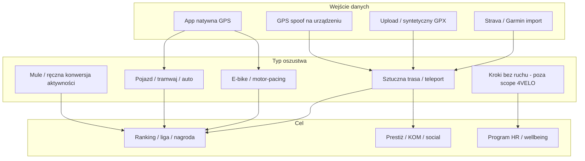
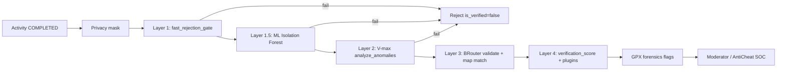

# SPORT / 4VELO — raport: jak działają oszukujący zawodnicy

| | |
|--|--|
| **Status** | Active |
| **Data** | 2026-06-11 |
| **Owner role** | Product / Security / Moderation |
| **Audience** | Product, Engineering, Moderation, Sales, Legal |
| **lang** | pl |
| **translation** | [English](../en/reports/SPORT_CHEATING_ATHLETES_REPORT_2026-06-11.en.md) |
| **canonical_path** | docs/reports/SPORT_CHEATING_ATHLETES_REPORT_2026-06-11.pl.md |
| **Powiązane** | [Raport rynkowy GTM](./SPORT_FULL_CONVERSATION_REPORT_2026-06-11.pl.md) · [Checklista 90 dni](./SPORT_DELIVERY_CHECKLIST_90D_2026-06-11.pl.md) |

---

## 0. Cel dokumentu

Opisać **jak realnie oszukują uczestnicy** w aplikacjach sportowo-rywalizacyjnych (miejskie ligi, firmy, kluby), z naciskiem na **trzy dyscypliny produktowe 4VELO**:

- **rower**,
- **bieganie**,
- **nordic walking**.

Raport łączy: sygnały społecznościowe (Reddit, fora), incydenty rynkowe (Strava, wyzwania krokowe), narzędzia open-source (GitHub), benchmark konkurencji oraz **istniejący pipeline anti-cheat w repozytorium SPORT**.

Cel operacyjny: wiedzieć, **przed czym bronić ranking**, co komunikować klientom (JST/HR/kluby) i które luki domknąć w produkcie.

---

## 1. Zakres i założenia

| W zakresie | Poza zakresem (świadomie) |
|------------|---------------------------|
| GPS spoof, pojazd, e-bike, fake GPX, mule, duplikaty tras | Wellness wyłącznie na krokach (Activy) — tylko jako kontekst konkurencji |
| Rower, bieg, nordic walking (typ `WALK` w backendzie) | 18 dyscyplin jak Aktywne Miasta |
| Oszustwa przy nagrodach / ligach / KOM-ach | Esport, hazard, move-to-earn |
| Obrona techniczna 4VELO + playbook moderacji | Pełna analiza prawna regulaminów konkursów |

**Nordic walking w kodzie:** aktywność mapowana na typ `WALK` z limitem kinetycznym ~3,5 m/s (~12,6 km/h) — wyższy niż zwykły spacer, ale poniżej biegu.

---

## 2. Metodologia

| Źródło | Co daje |
|--------|---------|
| [SPORT_FULL_CONVERSATION_REPORT_2026-06-11.pl.md](./SPORT_FULL_CONVERSATION_REPORT_2026-06-11.pl.md) | Kontekst rynku, problemy AM/Strava, pitch fair play |
| Repozytorium SPORT (`backend/activities/`) | Faktyczne warstwy anti-cheat i forensics |
| Internet: Strava, Fast Company, BikeRadar, MoveSpring, TestDevLab, Upkeep | Metody i reakcje rynku |
| GitHub: `fake-run`, `jogmock`, `strava-cheater` | Narzędzia generowania/manipulacji GPX |
| Społeczności: Reddit, AnandTech, People.com, Wykop (wcześniejszy research) | Motywacje i „hacki” użytkowników |

Uwaga: raport opisuje **wektory ataku znane publicznie** — wyłącznie w celu obrony produktu i polityki fair play, nie jako instrukcję.

---

## 3. Taksonomia oszustw (model wspólny)

### Macierz: metoda × dyscyplina × wykrywalność (uproszczona)

| Metoda | Rower | Bieg | Nordic walking | Typowa wykrywalność bez tech |
|--------|:-----:|:----:|:--------------:|------------------------------|
| Jazda autem / tramwajem | ✓✓✓ | ✓✓ | ✓ | Niska (regulamin) |
| E-bike jako rower klasyczny | ✓✓✓ | — | — | Średnia (Strava ML) |
| GPS Joystick / mock location | ✓✓ | ✓✓ | ✓✓ | Niska |
| Fake GPX (generator WWW/GitHub) | ✓✓ | ✓✓ | ✓ | Niska |
| Mule / płatna „przebiegnięta” aktywność | ✓ | ✓ | ○ | Bardzo niska |
| Shake-phone (kroki) | — | — | — | N/A (poza produktem) |
| Bieg zamiast NW / NW zamiast spaceru | — | ✓ | ✓✓ | Niska bez sensorów kijków |

Legenda: ✓✓✓ bardzo częste · ✓✓ częste · ✓ możliwe · — mało istotne

---

## 4. Metody oszustwa — szczegóły

### 4.1 Pojazd i transport publiczny (najczęstsze przy ligach km)

**Jak to działa:** użytkownik nagrywa trasę w tramwaju, autobusie, samochodzie (czasem „zapomina wyłączyć GPS” po treningu — uczciwy błąd lub wymówka).

**Sygnatura kinetyczna:**
- wysoka, stabilna prędkość (niska zmienność CV),
- wysoki stosunek displacement / długość trasy (prosta linia),
- skoki GPS (teleport) przy słabym sygnale lub spoof.

**Dlaczego działa w ligach:** suma km dla miasta/firmy/klubu — jedna długa trasa „dowozi” więcej niż tygodniowy trening.

**Przykłady rynkowe:** incydent AM (reklamacje km), STADTRADELN FAQ o GPS w tle, Strava usuwa miliony aktywności „in vehicle”.

**Obrona 4VELO:** warstwa 1 `fast_rejection_gate` — testy TELEPORT, ACCEL, MOTOR_FINGERPRINT, STRAIGHT-LINE RATIO (`backend/activities/signal_processing.py`).

---

### 4.2 GPS spoofing (aplikacje mock location)

**Jak to działa:** na Androidzie (częściej) aplikacje typu „GPS Joystick”, „Mock Locations” — urządzenie raportuje fałszywą pozycję bez fizycznego ruchu. Użytkownik może „przejechać” trasę na mapie siedząc w domu.

**Dlaczego popularne:** brak wysiłku, szybkie km, trudne do wykrycia bez analizy sensorów (akcelerometr, barometr) — Strava Community sugeruje brak flagi `spoofed` w API.

**Ryzyko dla 4VELO:** spoof o niskiej prędkości i z sztuczną zmiennością może przejść proste progi prędkości (wzorzec Naviki: 25/50 km/h to za mało).

**Obrona 4VELO:** gate + ML (Isolation Forest, 8 cech kinetycznych) + BRouter (trasa musi być routowalna po sieci drogowej) + porównanie dystansu GPS vs BRouter.

---

### 4.3 Syntetyczne i edytowane pliki GPX/TCX

**Jak to działa:**

1. **Generatory tras** — użytkownik rysuje trasę na mapie, ustawia tempo, pobiera GPX, uploaduje do Strava/Garmin/organizatora.
2. **Edytory prędkości** — mnożnik prędkości na istniejącym pliku (wszystkie timestampy przeliczane proporcjonalnie).
3. **„Realistyczne” generatory** — Perlin noise na prędkości (trudniejsze do wykrycia regułami).

**Ekonomia:** FakeMy.Run ~0,42 USD/plik; „Strava mules” 10–20 USD za „przebiegnięcie” za kogoś (Fast Company, NYT cytowane w prasie).

**Repozytoria GitHub (próbka 2025–2026):**

| Repo | Opis | Zagrożenie |
|------|------|------------|
| [Lo9ic/fake-run](https://github.com/Lo9ic/fake-run) | WWW: rysuj trasę, pace, export GPX (Strava/Garmin) | Wysokie — niski próg wejścia |
| [renbou/jogmock](https://github.com/renbou/jogmock) | CLI: Perlin noise na prędkości, upload Strava | Wysokie — „wygląda jak prawdziwy bieg” |
| [snmslavk/strava-cheater](https://github.com/snmslavk/strava-cheater) | Mnożnik prędkości GPX/TCX | Średnie — import wearables |

**Obrona 4VELO:**
- `route_fingerprint` — ten sam hash trasy u innego użytkownika → flaga `duplicate_route_fingerprint` (`gpx_forensics.py`),
- `metadata_distance_mismatch` — dystans metadanych vs polyline >15%,
- import ze Strava/Garmin → flaga `wearable_imported` (wyższe ryzyko, wymaga polityki).

---

### 4.4 E-bike i asysta silnikowa (rower)

**Jak to działa:** jazda na rowerze elektrycznym zapisana jako „klasyczny rower”; motor-pacing (jazda za samochodem); zjazd z góry z nierealistyczną średnią.

**Skala rynku:** Strava (2025–2026) usunęła **2,3 mln** aktywności e-bike zapisanych jako zwykły rower, **1,6 mln** pojazdów; model ML na **57 czynnikach** (prędkość, przyspieszenie itd.) — BikeRadar, Strava Engineering Blog.

**Luki branżowe:** drafting, wiatr w plecy, jazda w peletonie, velodrom — Strava przyznaje fałszywe negatywy i fałszywe pozytywy.

**Obrona 4VELO:**
- `BIKE` V-max 25 m/s (~90 km/h) w `analyze_anomalies` / forensics,
- MOTOR_FINGERPRINT (zbyt stała prędkość),
- brak jawnego modelu „e-bike declared” — **luka produktowa** jeśli klient wymaga podziału kategorii.

---

### 4.5 Oszustwa „społeczne” i organizacyjne

**Mule (człowiek za kogoś):** ktoś fizycznie biegnie/jedzie, ale aktywność jest przypisana do innego konta (płatna usługa). Technicznie GPS jest „prawdziwy” — wykrycie wymaga powiązań kont, urządzeń, wzorców czasowych.

**Ręczna konwersja aktywności na kroki (kontekst firm):** współpracowniczka ~65 000 kroków przez przeliczenie jogi/siatkówki (People.com / Reddit) — organizator nie zdyskwalifikował.

**Manipulacja bez technologii:** zgłaszanie fałszywych km do supportu (AM: 1000+ reklamacji po awarii serwera), naciski polityczne na JST.

**Playbook HR (MoveSpring):** nie oskarżać publicznie; zbierać daty i dane; wyjaśnienie od użytkownika; wyciszyć czat oskarżeń.

---

### 4.6 Nordic walking — specyfika

**Typowe oszustwa w lidze km:**
- **bieg zamiast NW** (wyższa prędkość, inna biomechanika) — GPS sam nie rozróżni,
- **jazda rowerem / rolkami** z telefonem — łapie gate pojazdu,
- **spoof** po ścieżce rowerowej — BRouter może pomóc jeśli trasa nieroutowalna dla `WALK`.

**Kierunek rynku (poza 4VELO):** smart kiije (Gabel e-poles, ONWF European Championships 2026) — sensory w kijkach: timing plantu, kontakt z gruntem, synchronizacja ramion; wykrywanie biegu zamiast techniki NW.

**Implikacja dla 4VELO:** przy pozycjonowaniu NW **GPS + anti-cheat kinetyczny to minimum**; różnicowanie techniki NW vs bieg to **luka** bez dodatkowych sygnałów (kadencja, akcelerometr, opcjonalnie integracja z urządzeniem zewnętrznym).

**Limity w kodzie:** `WALK` max 3,5 m/s — biegacz-amator na krótkim odcinku może przekroczyć; wymaga analizy **całej trasy**, nie pojedynczego segmentu.

---

### 4.7 Błędy uczciwe vs oszustwa (false positive / false negative)

| Sytuacja | Wygląda jak cheat | Faktycznie |
|----------|-------------------|------------|
| Słaby GPS w tunelu | Teleport, skoki | Błąd urządzenia |
| Zjazd rowerowy | Prędkość > limit | Legalny descen |
| Elite biegacz | V-max spike | Prawdziwy sprint |
| Telefon w kieszeni NW | Nieregularny GPS | Słaby sygnał |
| Zostawiony GPS w aucie po treningu | Cała trasa pojazdem | Błąd użytkownika (Strava: crop) |

Produkt musi rozróżniać **odrzucenie techniczne** vs **flaga do moderacji** — dziś `auto_ban` w `process_activity_async` może odrzucać agresywnie (config `telemetry:config`).

---

## 5. Co robi konkurencja

| Platforma | Podejście | Skuteczność |
|-----------|-----------|-------------|
| **Strava** | ML 57 cech, auto-flag, community flag, masowe backfill leaderboardów | Wysoka na KOM; słabsza poza segmentami |
| **Naviki** | Progi 25/50 km/h, max długość 100 km | Podstawowa — spoof nadal możliwy |
| **Aktywne Miasta** | Brak publicznej polityki tech | Niska przy nagrodach |
| **Activy / MoveSpring** | Regulamin + HR investigation; brak GPS anti-cheat | Bardzo niska na krokach |
| **Upkeep / zaawansowane step apps** | GPS + kadencja + HR korelacja | Średnia, tylko kroki |

Wniosek z [raportu GTM](./SPORT_FULL_CONVERSATION_REPORT_2026-06-11.pl.md): **fair play to USP 4VELO tylko jeśli jest widoczny** (polityka publiczna, status weryfikacji w UI, raport dla organizatora).

---

## 6. Pipeline anti-cheat 4VELO (stan repozytorium)

### Warstwy — skrót

| Warstwa | Plik / moduł | Co łapie |
|---------|--------------|----------|
| **1 — Fast gate** | `signal_processing.fast_rejection_gate` | Teleport >500 m, accel >6 m/s², CV prędkości <5%, prosta linia >92% |
| **1.5 — ML** | `ml_anomaly.py` | Anomalie statystyczne (8 cech: mean/std speed, CV, accel, p90, fast fraction, straight ratio, seg var) |
| **2 — V-max** | `analyze_anomalies` | RUN 12 m/s, BIKE 25 m/s, WALK 3,5 m/s; ratio anomalii >20% lub 3+ kolejne naruszenia |
| **3 — BRouter** | `BRouterService.validate_track` | Trasa nieroutowalna / dystans topo vs GPS |
| **4 — Score + pluginy** | `tasks.process_activity_async` | `verification_score`, `registry.fire('validate_activity')` |
| **Forensics (batch)** | `gpx_forensics.scan_activity_forensics` | Duplikat fingerprint, mismatch dystansu, peak speed, wearable import, sim |

**Progi V-max (m/s):** RUN 12 · BIKE 25 · WALK 3,5 · WHEELCHAIR 8 (`signal_processing.py`, `gpx_forensics.py`).

**Moderacja:** panel `admin/src/modules/anti-cheat/AntiCheat.tsx`, API `AntiCheatEngine.get_recent_anomalies`.

---

## 7. Wektory nadal możliwe (luki)

| Wektor | Dlaczego przechodzi | Priorytet mitigacji |
|--------|---------------------|---------------------|
| GPX „realistyczny” (jogmock) z umiarkowaną prędkością | Spełnia V-max i może przejść BRouter | Wyższa waga ML + duplikaty tras + ograniczenie importu w ligach |
| Mule / udostępnione konto | Prawdziwy GPS, inny owner | Device binding, anomalie konta, rate limits |
| E-bike umiarkowany | Pod progiem „motor vehicle fingerprint” | Deklaracja kategorii, power/cadence z Garmin gdy dostępne |
| NW vs bieg | Ten sam typ `WALK` | Kadencja kroków, opcjonalnie partner smart-kijki (długi termin) |
| Spoof wolny + kręte ulice | Wyższy CV, niższy straight ratio | Akcelerometr w mobile (brak w pipeline server-only) |
| Kolega jedzie rowerem „dla klubu” | Trudne moralnie, technicznie OK | Regulamin + normalizacja na aktywnego, nie na sumę |
| Organizator nie egzekwuje | Brak procesu | Playbook HR/JST + raport fair-play flags |

---

## 8. Rekomendacje dla 4VELO

### Tier 0 — polityka i zaufanie (bez kodu)

1. **Publiczna Anti-Cheat / Scoring Policy** — jawnie: co dyskwalifikuje, appeal process (z checklisty GTM).
2. **Status w UI użytkownika:** zweryfikowana / w kolejce / odrzucona + powód (nie tylko „brak km”).
3. **Regulamin ligi:** zabronione — pojazd, spoof, cudzy GPX, mule; przy nagrodach — weryfikacja moderatora.

### Tier 1 — produkt (90 dni)

4. **Ograniczenie dyscyplin** do rower / bieg / NW w UI i regulaminie (już w checklistie).
5. **Ligi z nagrodami:** domyślnie tylko aktywności `is_verified=true` + native GPS (import Strava/Garmin = flaga, nie auto-count lub niższa waga).
6. **Raport końca sezonu** z `forensics_flags` i % odrzuceń (dla HR/burmistrza).
7. **Kalibracja `auto_ban`:** rozróżnienie hard reject vs soft flag do moderacji (mniej false positive na zjazdach).

### Tier 2 — techniczne wzmocnienia

8. **Akcelerometr / cadence** w mobile jako sygnał pomocniczy (weryfikacja „urządzenie się ruszało”).
9. **Heurystyki NW:** średnia prędkość 1,5–2,5 m/s zwykle; długie odcinki >4 m/s → flaga „possible run not NW”.
10. **Graph fraud:** ten sam fingerprint trasy w wielu tenantach / eventach.
11. **Retrain ML** na oznakowanych odrzuceniach z produkcji (Strava model: labeled data z community flags).

### Świadomie nie na start

- Pełna integracja smart-kijków (Gabel) — nisza federacyjna, nie MVP ligi firmowej.
- Konkurowanie z Strava po wykrywaniu na segmentach KOM — inny use-case (ligi tenantów).

---

## 9. Playbook moderacji (skrót operacyjny)

1. **Priorytet kolejki:** `verification_score` < 0,15 (critical) → < 0,25 (high) — `AntiCheatEngine.anomaly_severity`.
2. **Sprawdź flagi:** `duplicate_route_fingerprint`, `kinematic_speed_anomaly`, `metadata_distance_mismatch`, `wearable_imported`.
3. **Nie publikuj oskarżeń** w czacie ligi (wzorzec MoveSpring).
4. **Kontakt do użytkownika:** konkretne daty i metryki („14.06 średnia 38 km/h przez 40 min”).
5. **Decyzje:** approve (false positive) · reject activity · warn · ban z eventu · forward do GO.
6. **Cel czasu:** <60 s na case (z TENANT_ADMIN overhaul) — mierzyć w produkcji.

---

## 10. Podsumowanie

Oszukujący zawodnicy w ligach **rower / bieg / nordic walking** najczęściej:

1. **„Dowiozą km” pojazdem** lub e-bikeiem (największy wpływ na ranking),
2. **Syntetycznie generują GPX** (narzędzia WWW i GitHub — niski koszt),
3. **Spoofują GPS** na telefonie,
4. **Korzystają z mule / importu** tam, gdzie organizator nie weryfikuje,
5. W NW **zastępują technikę biegiem** — GPS tego nie widzi.

4VELO ma **rzadki na rynku miejskim stack** (gate + ML + V-max + BRouter + forensics), ale **wygrana w ligach zależy też od procesu** (polityka, moderacja, raport). Największa luka produktowa względem ambicji NW: **brak sygnału biomechanicznego** poza kinetyką GPS.

---

## 11. Źródła i zakres

- Dokumenty wewnętrzne: `docs/reports/SPORT_*_2026-06-11*.md`, `docs/pl/ARCHITECTURE.md`, `docs/admin/P2_ROADMAP.md`
- Kod: `backend/activities/tasks.py`, `signal_processing.py`, `ml_anomaly.py`, `gpx_forensics.py`, `services.py`
- Zewnętrzne: [Strava Segment Guidelines](https://support.strava.com/hc/en-us/articles/216919507), [Strava Engineering — leaderboards](https://stories.strava.com/articles/keeping-stravas-segment-leaderboards-fair-an-engineers-perspective), [BikeRadar — Strava cleanup](https://www.bikeradar.com/news/strava-deletes-2-3m-electric-bike-activities), [Fast Company — Fake My Run](https://www.fastcompany.com/91345326/this-viral-app-lets-users-upload-fake-workouts-to-strava), [TestDevLab — fitness app cheating](https://www.testdevlab.com/blog/testing-fitness-apps-can-you-cheat-the-algorithm), [Upkeep — step anti-cheat](https://upkeep.social/blog/how-anti-cheat-works-step-challenge-apps), GitHub: fake-run, jogmock, strava-cheater

Raport przygotowany 2026-06-11. Nie zastępuje porady prawnej przy regulaminach konkursów z nagrodami.
