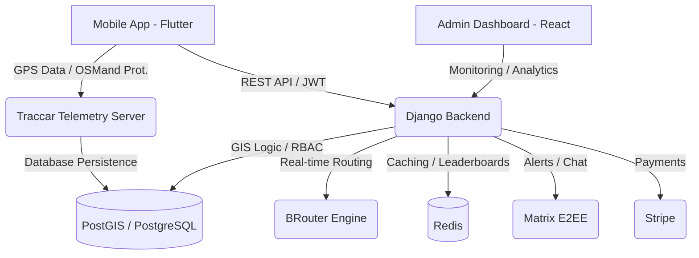
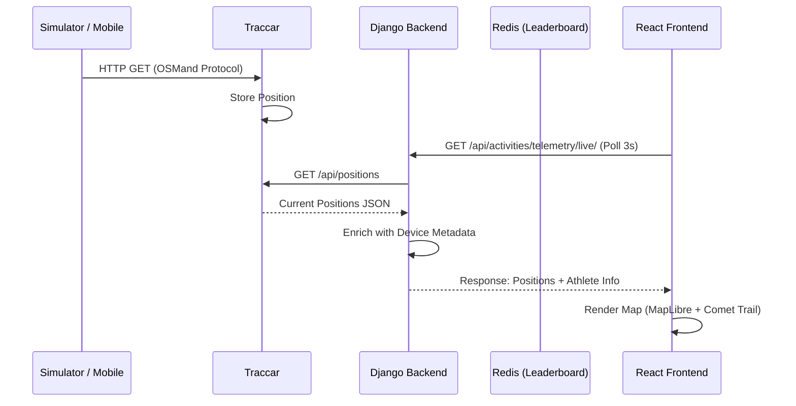

# Dokumentacja Techniczna Platformy SPORT

## 1. Wstęp i Misja
SPORT to nowoczesna platforma B2B/B2C zaprojektowana do gamifikacji aktywności fizycznej, zarządzania społecznościami sportowymi oraz precyzyjnej analizy telemetrii GPS w czasie rzeczywistym.

## 2. Architektura Systemu
System oparty jest na architekturze mikro-usługowej i konteneryzacji (Podman/Docker).

## 3. Przepływ Danych Telemetrycznych (Live Tracking)

## 4. Co już działa (Status Projektu)

### Backend (Django + GeoDjango)
- **Infrastruktura**: Pełny stack kontenerowy (DB, Redis, Traccar, BRouter).
- **Telemetria**: Integracja z Traccar, pobieranie pozycji live, mapowanie ID urządzeń na użytkowników.
- **Geospatial**: PostGIS skonfigurowany pod indeksy przestrzenne (GIST).
- **Privacy**: Automatyczne maskowanie punktów GPS w "Strefach Prywatności" użytkownika (Article 10).
- **Anti-Cheat**: Walidacja topologiczna tras przez BRouter (wykrywanie niemożliwych skrótów).
- **Auth**: JWT z rotacją tokenów + Social Auth (Google).

### Admin Dashboard (React + Vite)
- **Live Map**: Silnik MapLibre z płynnym renderowaniem "ogonów komet" (Canvas/GPU).
- **RBAC**: Interfejs dostosowujący się do roli (Global Admin vs Moderator).
- **Analytics**: Statystyki KPI, prędkości, aktywnych zawodników.

## 5. Backlog i Rozwój (Co zostało do zrobienia)

| Moduł | Status | Zadania |
| :--- | :--- | :--- |
| **Mobile App** | 🟡 In Progress | Implementacja logiki Background Tracking, Sync Manager (offline-first). |
| **Events Engine** | 🔴 Backlog | Modele `Event`, `Achievement`, system punktacji (Normalization Engine). |
| **Matrix Sync** | 🟡 In Progress | Auto-provisioning pokoi dla klubów sportowych. |
| **Voucher System** | 🟡 In Progress | Pełny marketplace POI (wymiana punktów na vouchery u sponsorów). |
| **CI/CD Hardening**| 🟢 Done | Skalowanie kontenerów, skanowanie bezpieczeństwa (Trivy). |

## 6. Stack Techniczny
- **Backend**: Python 3.11, Django 4.2, DRF, Celery.
- **Database**: PostgreSQL 15 + PostGIS 3.3.
- **Cache/Queue**: Redis 7.
- **Frontend**: TypeScript, React 18, Vite, MapLibre GL.
- **Mobile**: Flutter 3.x, Riverpod.
- **Telemetry**: Traccar 6.
- **Routing**: BRouter 1.7.
