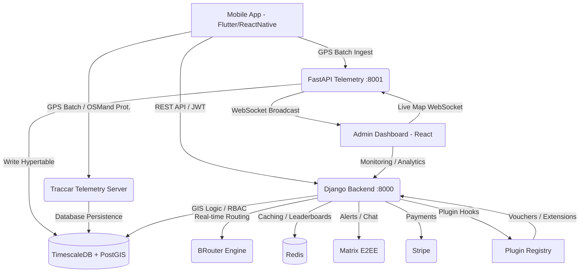
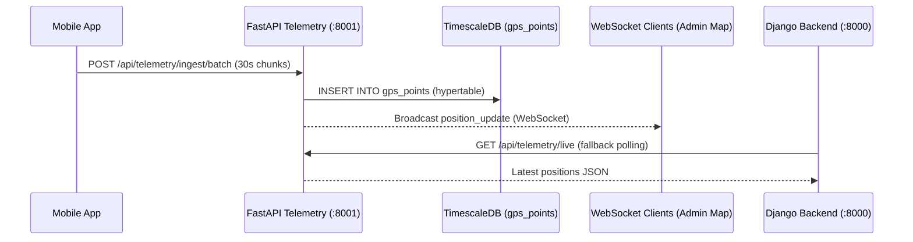

# Dokumentacja Techniczna Platformy SPORT (v2.0)
> Ostatnia aktualizacja: 2026-04-24

## 1. Wstęp i Misja
SPORT to nowoczesna platforma B2B/B2C zaprojektowana do gamifikacji aktywności fizycznej, zarządzania społecznościami sportowymi oraz precyzyjnej analizy telemetrii GPS w czasie rzeczywistym.

## 2. Architektura Systemu (v2)
System oparty jest na architekturze hybrydowej (Django Core + FastAPI Telemetry) z konteneryzacją (Podman/Docker).



## 3. Przepływ Danych Telemetrycznych (v2 — FastAPI + TimescaleDB)


## 4. Przetwarzanie Sygnału GPS (Constitution §24.2)
Każda trasa przechodzi przez 3-etapowy potok walidacji:

```
Raw GPS → Kalman Filter → Kinematic Anomaly Detection → BRouter Map Matching → DB
```

1. **Kalman Filter** (`activities/signal_processing.py`): Usuwa szumy GPS i dryfowanie.
2. **Kinematic Check**: Weryfikuje prędkość względem biomechanicznych maksimów dla danej dyscypliny.
3. **Map Matching**: Nakłada wygładzoną trasę na sieć dróg OSM (BRouter) z progiem 30m.

## 5. Co działa (Status Projektu)

### Backend (Django + GeoDjango)
- ✅ **Infrastruktura**: Pełny stack kontenerowy (TimescaleDB, Redis, Traccar, BRouter).
- ✅ **Telemetria**: Integracja z Traccar, pobieranie pozycji live.
- ✅ **Geospatial**: PostGIS + GIST indeksy przestrzenne.
- ✅ **Privacy**: Automatyczne maskowanie punktów GPS w Strefach Prywatności.
- ✅ **Anti-Cheat v2**: Kalman Filter + Kinematic Check + BRouter Map Matching.
- ✅ **Auth**: JWT z rotacją tokenów + Social Auth (Google).
- ✅ **Events Engine**: Modele Event/Participation/Achievement + normalizacja INTER_TENANT.
- ✅ **Plugin Registry**: Hook system (`core/plugin_registry.py`), wbudowany plugin Voucher Hotspots.
- ✅ **OGC API**: Endpoint `/api/events/{id}/ogc/boundary/` (Moving Features standard).

### Mikroserwis Telemetrii (FastAPI)
- ✅ **Hypertable**: Auto-tworzenie tabeli `gps_points` w TimescaleDB.
- ✅ **Batch Ingest**: `POST /api/telemetry/ingest/batch` (GPS batching).
- ✅ **WebSocket Live**: `/ws/telemetry/live` (live map broadcast).
- ✅ **History Query**: `GET /api/telemetry/history/{device_id}` (TimescaleDB range queries).

### Admin Dashboard (React + Vite)
- ✅ **Live Map**: Silnik MapLibre z renderowaniem "ogonów komet".
- ✅ **RBAC**: Interfejs dostosowujący się do roli.
- ✅ **Analytics**: Statystyki KPI, prędkości, aktywnych zawodników.

## 6. Backlog i Rozwój

| Moduł | Status | Zadania |
| :--- | :--- | :--- |
| **Mobile App** | 🟡 In Progress | Background Tracking, Sync Manager (offline-first), React Native Fabric. |
| **Matrix Sync** | 🟡 In Progress | Auto-provisioning pokoi dla klubów sportowych. |
| **Voucher Marketplace** | 🟡 In Progress | UI marketplace POI (wymiana punktów na vouchery u sponsorów). |
| **Viterbi HMM** | 🔴 Backlog | Pełna implementacja algorytmu Viterbi dla Map Matching (offline OSM graph). |
| **CI/CD Hardening** | 🟢 Done | Skalowanie kontenerów, skanowanie bezpieczeństwa (Trivy). |
| **TimescaleDB** | 🟢 Done | Hypertable konfiguracja w docker-compose + auto-init. |
| **FastAPI Telemetry** | 🟢 Done | Mikroserwis z batch ingest, WebSocket, history query. |
| **Plugin System** | 🟢 Done | PluginRegistry + Voucher Hotspots plugin. |
| **Kalman Filter** | 🟢 Done | GPS signal processing pipeline. |
| **OGC API** | 🟢 Done | Moving Features boundary endpoint. |
| **Events Engine** | 🟢 Done | REST API, leaderboard, INTER_TENANT normalization, Admin. |

## 7. Stack Techniczny (v2)
- **Backend Core**: Python 3.11, Django 4.2, DRF, Celery.
- **Telemetry Engine**: Python 3.11, FastAPI 0.111, asyncpg, uvicorn.
- **Database**: PostgreSQL 15 + PostGIS 3.x + **TimescaleDB**.
- **Cache/Queue**: Redis 7.
- **Frontend**: TypeScript, React 18, Vite, MapLibre GL.
- **Mobile**: Flutter 3.x (→ React Native Fabric docelowo).
- **Telemetry**: Traccar 6.
- **Routing**: BRouter 1.7.
- **Plugin System**: Native hook registry (`core/plugin_registry.py`).
