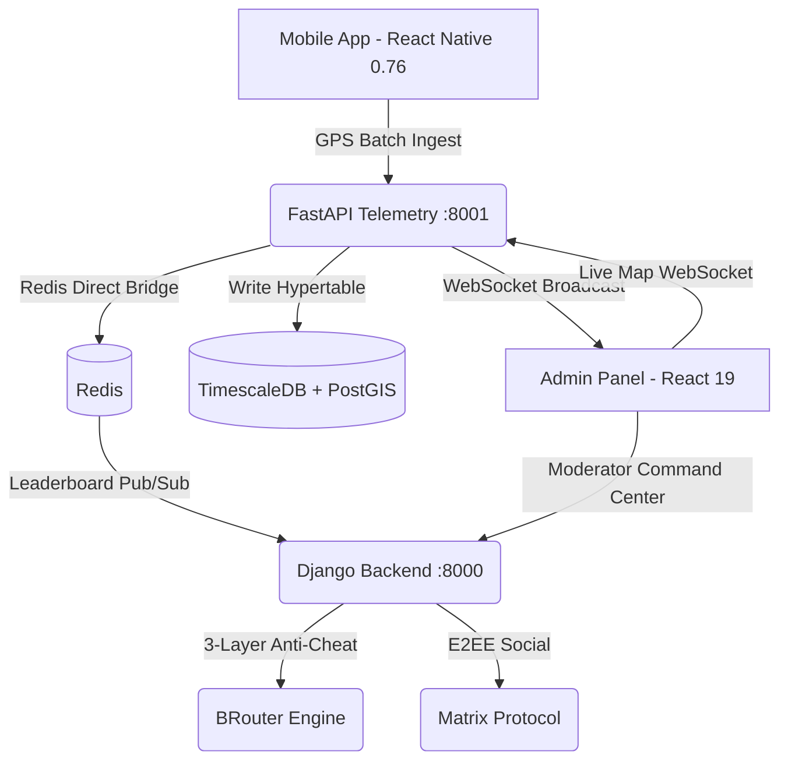

# DOKUMENTACJA TECHNICZNA PLATFORMY SPORT (v0.2.0-alpha)
> Ostatnia aktualizacja: 2026-04-24 | Milestone 2 (Engine V2 & Anti-Cheat)

## 1. Wstęp i Misja
SPORT to wysokowydajna platforma B2B/B2C zaprojektowana do gamifikacji aktywności fizycznej, zarządzania społecznościami miejskimi (B2G) oraz precyzyjnej analizy telemetrii GPS w czasie rzeczywistym.

## 2. Architektura Systemu (High-Performance Sync)
System oparty jest na architekturze hybrydowej **"Power Couple"** (Django Core + FastAPI Telemetry) z pełną konteneryzacją.

## 3. Przepływ Danych Telemetrycznych (v2 — Sync Direct)
1.  **Ingest**: Aplikacja mobilna wysyła paczki (batch) punktów GPS do FastAPI (`/api/telemetry/ingest/batch`).
2.  **Bridge**: FastAPI przesyła pozycje bezpośrednio do kanału Redis Pub/Sub (`traccar:positions`).
3.  **Persistence**: Punkty trafiają do Hypertabel w TimescaleDB (optymalizacja szeregów czasowych).
4.  **Live**: Panel Admina subskrybuje WebSockety FastAPI dla natychmiastowej wizualizacji śladów "ogonów komet".

## 4. Silnik Anti-Cheat (3-Warstwowa Weryfikacja)
Każda aktywność przechodzi przez rygorystyczny potok walidacji przed zatwierdzeniem w rankingach:

1.  **Warstwa 1: Fast Selection Gate** (`fast_rejection_gate`):
    - O(N) czysta matematyka (Teleportacja, Akceleracja, Fingerprint pojazdu, Straight-line ratio).
    - Odrzuca "tramwaje" i "samochody" przed obciążeniem silników mapowych.
2.  **Warstwa 2: Kinematic Anomaly Detection**:
    - Weryfikacja prędkości względem biomechanicznych limitów (V-max) per dyscyplina.
    - Filtracja szumów za pomocą Filtra Kalmana.
3.  **Warstwa 3: BRouter Map Matching (Viterbi HMM)**:
    - Dopasowanie trasy do sieci OSM za pomocą algorytmu Viterbi.
    - Weryfikacja topologiczna (czy trasa nie przecina budynków/rzek).

## 5. Status Projektu (Milestone 2)

### Backend & Telemetry
- ✅ **Redis Direct Pipeline**: Eliminacja lagów HTTP w przesyłaniu pozycji.
- ✅ **TimescaleDB Integration**: Hypertabela `gps_points` z automatycznym chunkingiem.
- ✅ **Anti-Cheat V2**: Pełna implementacja 3 warstw (Gate, V-max, BRouter).
- ✅ **Materialized Views**: `city_rankings_mv` dla błyskawicznych rankingów miejskich.
- ✅ **Plugin System**: Pluggy hooks dla walidatorów sportowych.

### Admin Dashboard (React 19)
- ✅ **Moderator View**: Panel weryfikacji oflagowanych aktywności (split-screen).
- ✅ **MapTrackViewer**: Reużywalny komponent MapLibre do wizualizacji anomalii na trasie.

### Mobile (React Native 0.76)
- ✅ **Haversine Engine**: Obliczanie dystansu i tempa w czasie rzeczywistym na urządzeniu.
- ✅ **MMKV Buffer**: Bezpieczne buforowanie punktów GPS offline.

## 6. Stack Techniczny
| Komponent | Technologia | Rola |
| :--- | :--- | :--- |
| **Backend** | Python 3.12, Django 4.2 LTS, Celery | Logika biznesowa, RBAC, API |
| **Telemetry** | Python 3.12, FastAPI, asyncpg | Szybki ingest, WebSockety |
| **Database** | TimescaleDB (PostGIS) | Dane przestrzenne i szeregi czasowe |
| **Cache** | Redis 7 | Leaderboardy, Pub/Sub, Pipelines |
| **Mobile** | React Native 0.76, Expo, MMKV | Tracking, Offline-first, UI |
| **Admin** | React 19, Vite, MapLibre GL | Dashboard, Moderator Panel |
| **Routing** | BRouter 1.7 | Walidacja topologiczna trasy |
