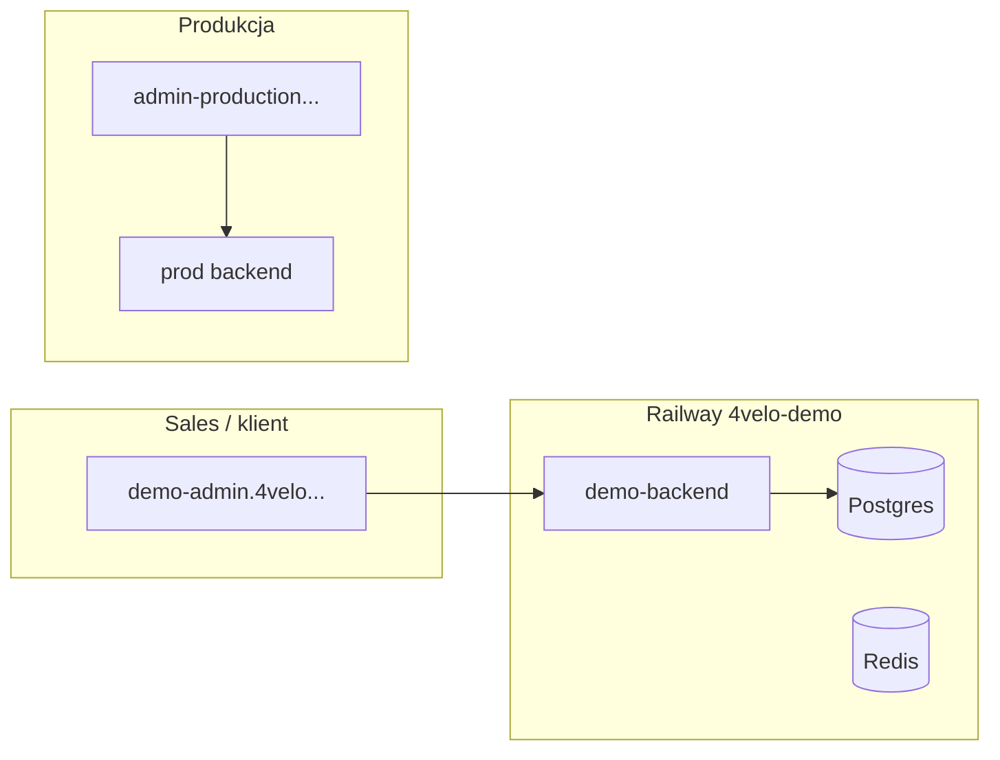

# SL-DEMO-001: Demo environment (sales)

| | |
|--|--|
| **Status** | Planned |
| **Owner role** | Platform Operator |
| **Last reviewed** | 2026-06-09 |
| **ADR** | [013-sim-lab-read-federation.md](../adr/013-sim-lab-read-federation.md) |

## Cel

Osobne środowisko do pokazów handlowych i onboardingów klientów — **bez** mieszania danych syntetycznych z produkcją i **bez** obciążania prod przez federation.

Sim-lab + read federation na prod służy **operatorom** (load test z prod UI). Demo env służy **klientom i sales**.

## Architektura



**Brak** `SIM_LAB_PROXY` między prod a demo. Zero współdzielonych baz.

## Provisioning (Railway)

1. Utwórz projekt Railway `4velo-demo` (osobny od `marvelous-gratitude` i `4velo-sim-lab`).
2. Wdróż z monorepo: `backend`, `telemetry`, `db`, `redis`, `global_admin` (profil [`smoke.env`](../../infrastructure/sim-lab/railway/profiles/smoke.env) lub mniejszy).
3. Admin build z `VITE_API_URL=https://<demo-backend>.up.railway.app/api`.
4. Domena: `demo-admin.<domena>` — **nigdy** `admin-production...` z federation dla sales.

## Seed danych

| Parametr | Wartość |
|----------|---------|
| Użytkownicy syntetyczni | 2 000 – 5 000 |
| Miasta | 3–5 (profil smoke) |
| Live sim | opcjonalnie 200–500 ACTIVE na mapie |

```powershell
$env:SIM_LAB_API_BASE = 'https://<demo-backend>.up.railway.app/api'
$env:ADMIN_PASS = '<demo global_owner password>'
.\infrastructure\sim-lab\scripts\preflight-sim-lab.ps1
# Batch przez Simulator UI na demo-admin lub run-300k-wipe-batch z mniejszą liczbą
```

## Reset cadence

| Częstotliwość | Akcja |
|---------------|-------|
| Co tydzień (cron Railway / GitHub Action) | `wipe-data` + batch smoke |
| Przed ważnym demo | Ręczny reset + live sim 15 min |
| Po demo | Opcjonalny wipe (bez danych klienta — tylko syntetyczne) |

Skrypt referencyjny: `scripts/wipe-prod-local.mjs` — **na demo API**, nie na prod.

## Checklist przed demo

- [ ] `demo-admin` ładuje się, login `global_owner` działa
- [ ] Dashboard KPI > 0 użytkowników
- [ ] Live map pokazuje kolarzy (live sim ON)
- [ ] Brak banera „symulacja na sim-lab” (to jest natywne demo, nie federation)
- [ ] Mobile / inne klienty **nie** wskazują na demo API

## Anti-patterns

- Używanie prod admin URL do sales demo z `SIM_LAB_READ_FEDERATION_ENABLED`
- Współdzielenie `SECRET_KEY` / DB z prod
- Zostawianie 300k userów na demo (wolny dashboard, mylące liczby)

## Powiązane

- [sim-lab-read-federation.md](sim-lab-read-federation.md) — federation dla operatorów
- [infrastructure/sim-lab/README.md](../../infrastructure/sim-lab/README.md)
