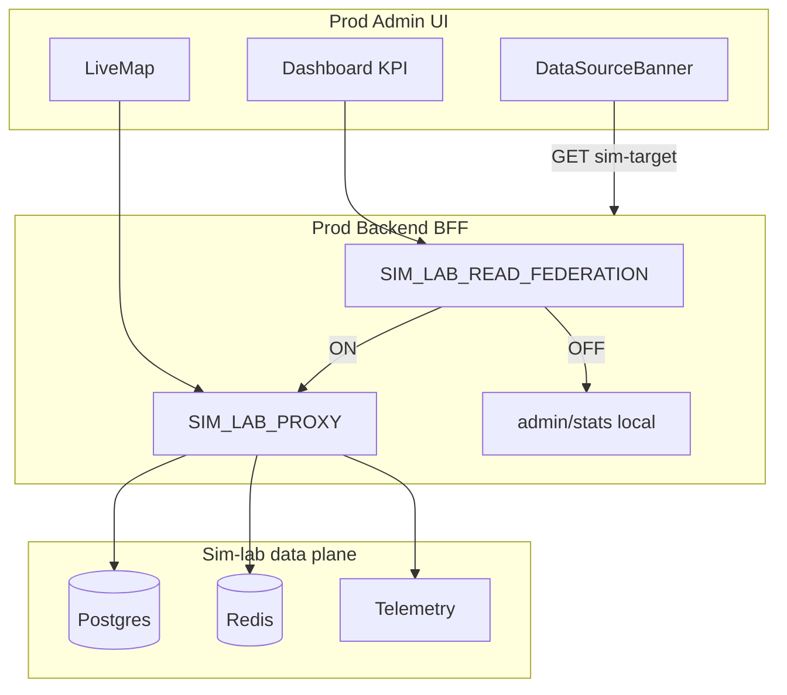

# SL-RF-001: Sim-lab — federacja odczytu (prod admin → sim-lab)

| | |
|--|--|
| **Status** | Active — Faza 1 |
| **Owner role** | Platform Operator |
| **Last reviewed** | 2026-06-09 |
| **ADR** | [013-sim-lab-read-federation.md](../adr/013-sim-lab-read-federation.md) |

## Problem

Sim-lab ma osobny data plane (Postgres, Redis, Celery, telemetry). Prod admin domyślnie czyta prod backend. Przy `SIM_LAB_PROXY_ENABLED` sterowanie symulatorem i mapa na żywo są proxy’owane, ale **KPI dashboardu** (`admin/stats`) i `sim_kpi` czytały prod — symulacja 20k userów nie była widoczna na kartach KPI.

## Cel

Profesjonalny standard:

1. **Osobny data plane** — sim-lab bez współdzielenia Postgres/Redis z prod.
2. **Federacja odczytu** — prod backend (BFF) proxy’uje wybrane GET do sim-lab.
3. **Etykiety syntetycznych danych** — `data_source`, `synthetic`, baner w UI.
4. **Sales demo** — osobne środowisko ([demo-environment.md](demo-environment.md)), nie mieszanie z prod.

## Architektura



## Kontrakt API (`data_source`)

Wszystkie odpowiedzi federowane z sim-lab:

```json
{
  "data_source": "sim-lab",
  "synthetic": true,
  "sim_lab_proxy": true,
  "sim_lab_label": "4velo-sim-lab"
}
```

- `data_source`: `"production"` | `"sim-lab"`
- `synthetic: true` — dane wygenerowane przez symulator
- Prod-only (nigdy federowane): `/infra/health/`, `/users/audit-log/`, auth, billing

Helper: `annotate_federated_payload()` w `backend/activities/sim_lab_proxy.py`.

## Endpoint matrix

| Endpoint | Faza | Proxy | Widok admin |
|----------|------|-------|-------------|
| `GET /activities/admin/stats/` | **1** | Tak (federation) | Dashboard, CityAnalytics, ModeratorWorklist |
| `GET /activities/telemetry/live/` | 0 | Tak | LiveMap |
| `GET /activities/telemetry/live/aggregate/` | 0 | Tak | LiveMap |
| `POST simulate/`, `live-simulate/`, wipe | 0 | Tak | SimulatorPage |
| `GET /activities/admin/sim-target/` | 1 | Lokalny (meta) | DataSourceBanner |
| `GET /activities/admin/all/` | **2** | Plan | ActivitiesList |
| `GET /activities/analytics/` | **2** | Plan | TrendAnalysis |
| `GET /activities/analytics/department/` | **2** | Plan | DepartmentAnalyticsPage |
| `GET /activities/telemetry/anomalies/` | **2** | Opcjonalnie | ModeratorInbox |
| `GET /users/all/`, RBAC, audit, export | — | **Nie** | — |

## Zmienne środowiskowe (prod backend)

| Zmienna | Domyślnie | Opis |
|---------|-----------|------|
| `SIM_LAB_PROXY_ENABLED` | `0` | Wymagane dla całego proxy |
| `SIM_LAB_READ_FEDERATION_ENABLED` | `0` | Federacja odczytu KPI (`admin/stats`) |
| `SIM_LAB_PROXY_STATS_TIMEOUT` | `15` | Timeout proxy stats (s) |
| `SIM_LAB_PROXY_STATS_CACHE_TTL` | `30` | Opcjonalny cache odpowiedzi stats na prod (s) |
| `SIM_LAB_PROXY_MAP_TIMEOUT` | `180` | Timeout mapy (istniejące) |

Konfiguracja Railway: `setup-sim-lab-proxy.ps1 -Redeploy` (ustawia też federation).

## Faza 1 — Dashboard demo / load test (Tier 1)

### Zakres implementacji (Faza 1 — zrobione w repo)

- [x] `SIM_LAB_READ_FEDERATION_ENABLED`
- [x] Proxy `GET admin/stats/`
- [x] `sim_kpi` z sim-lab Redis (przez wykonanie stats na sim-lab)
- [x] Rozszerzenie `sim-target/` (`read_federation_enabled`, `dashboard_data_source`)
- [x] `DataSourceBanner` + `useSimDataSource` w admin
- [x] Testy + preflight readiness
- [ ] Weryfikacja na Railway po `setup-sim-lab-proxy.ps1 -Redeploy`

### Runbook weryfikacji

```powershell
# 1. Proxy + federation na prod
.\infrastructure\sim-lab\scripts\setup-sim-lab-proxy.ps1 -Redeploy

# 2. Batch 20k na sim-lab (przez prod Simulator lub skrypt)
$env:SIM_LAB_API_BASE = 'https://backend-production-80cf.up.railway.app/api'
$env:ADMIN_PASS = 'admin123'
.\scripts\run-300k-wipe-batch.ps1  # z mniejszą liczbą userów w UI

# 3. Live sim z SimulatorPage (prod admin)
# 4. Preflight z prod stats
$env:PROD_ADMIN_PASS = '<prod password>'
.\infrastructure\sim-lab\scripts\preflight-sim-lab-readiness.ps1
```

### Acceptance criteria Fazy 1

- [ ] Prod admin + proxy + federation: `total_users` ≈ 20k po batch na sim-lab
- [ ] `sim_kpi.sim_on === true` gdy live sim działa na sim-lab
- [ ] Baner „Widok symulacji” widoczny na dashboardzie
- [ ] `GET sim-target/` → `read_federation_enabled: true`, `dashboard_data_source: "sim-lab"`
- [ ] Wyłączenie `SIM_LAB_READ_FEDERATION_ENABLED` → dashboard wraca do prod DB

## Faza 2 — Analytics i listy (Tier 2)

**Status:** zaplanowane, nie w Fazie 1.

| Zadanie | Priorytet | Uwagi |
|---------|-----------|-------|
| Proxy `GET /activities/admin/all/` | P1 | Read-only |
| Proxy `GET /activities/analytics/` | P1 | Cache + timeout |
| Proxy `GET /activities/analytics/department/` | P2 | |
| Proxy `GET /activities/telemetry/anomalies/` | P3 | Opcjonalnie |
| **Faza 2b:** metrics bridge | P2 | sim-lab → prod Redis snapshot co 60s; `GET /admin/stats/sim-snapshot/` |

**Nie federować:** `users/all/`, RBAC, audit log, export, impersonate.

## Anti-patterns

- Replikacja userów sim-lab → prod Postgres
- Federation endpointów mutujących poza istniejącym sim proxy
- Ukrywanie `synthetic: true` w UI
- Sales demo przez prod admin z federation zamiast osobnego demo env

## Pliki

| Obszar | Pliki |
|--------|-------|
| Backend | `sim_lab_proxy.py`, `admin_views.py`, `test_sim_lab_proxy.py` |
| Admin | `useSimDataSource.ts`, `DataSourceBanner.tsx`, `Dashboard.tsx`, `GoHealthStrip.tsx` |
| Ops | `setup-sim-lab-proxy.ps1`, `preflight-sim-lab-readiness.ps1` |
| Docs | ten plik, ADR-013, `infrastructure/sim-lab/README.md` |
