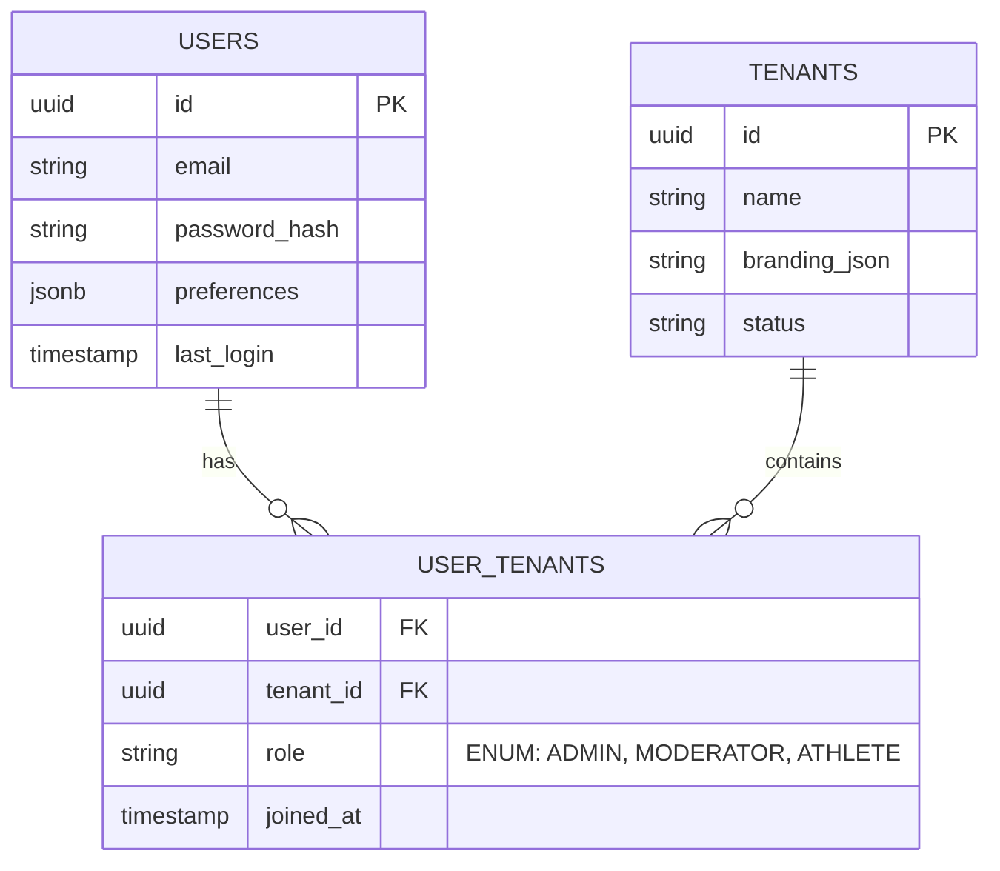

# RE-DESIGN LOGIKI UŻYTKOWNIKÓW I ZARZĄDZANIA (USER MANAGEMENT V2)

Ten dokument opisuje nową architekturę zarządzania użytkownikami, system ról (RBAC), oraz powiązanie z systemem Multi-Tenant (B2B2C) na platformie SPORT.

## 1. Hierarchia Ról i Tożsamość (Identity)

Zamiast płaskiej struktury, wdrażamy pełny model Role-Based Access Control (RBAC) oparty na JWT oraz PostgreSQL Row-Level Security (RLS).

### Typy Kont (Roles)
1.  **Global Admin (Platform Owner)**:
    - Pełny dostęp do całego klastra i wszystkich schematów bazy.
    - Tworzenie i usuwanie Tenantów (miast/klientów B2B).
    - Zarządzanie globalnymi regułami Anti-Cheat.
2.  **Tenant Admin (Klient B2B)**:
    - Dostęp **ograniczony do jednego Tenanta** (np. *Urząd Miasta Siedlce*).
    - Zarządzanie subskrypcjami użytkowników wewnątrz własnego Tenanta.
    - Widzi tylko anonimizowane globalne statystyki, ale pełne dane swoich użytkowników.
3.  **Moderator (Pracownik Tenanta)**:
    - Dostęp tylko do wyznaczonych modułów (np. akceptacja tras, obsługa zgłoszeń Anti-Cheat).
    - Nie może zmieniać ustawień finansowych Tenanta.
4.  **End User (Athlete / B2C)**:
    - Zwykły użytkownik aplikacji mobilnej.
    - Może należeć do **wielu Tenantów** (np. biega dla "Siedlce City" i jest w firmowej lidze "Corp Health").

---

## 2. Model Bazodanowy (PostgreSQL)

Wprowadzamy tabelę łącznikową (Junction Table), aby umożliwić relację Many-to-Many między Użytkownikami a Tenantami.



### Izolacja Danych (Postgres RLS)
Dla zapewnienia najwyższego bezpieczeństwa (multi-tenancy), włączamy **Row-Level Security**.
Każde zapytanie z backendu (Django/FastAPI) ustawia lokalną zmienną sesji `sport.current_tenant_id`.

```sql
-- Przykład polisy RLS dla tabeli 'activities'
ALTER TABLE activities ENABLE ROW LEVEL SECURITY;

CREATE POLICY tenant_isolation_policy ON activities
    USING (tenant_id = current_setting('sport.current_tenant_id')::uuid);
```

---

## 3. Przepływ Uwierzytelniania (Authentication Flow)

1. **Logowanie (Mobile/Web)**: Użytkownik podaje email/hasło lub używa OAuth (Apple/Google).
2. **Generowanie Tokena (JWT)**:
   - Backend sprawdza poświadczenia.
   - W Payloadzie JWT znajduje się struktura:
     ```json
     {
       "sub": "user_uuid",
       "global_role": "NONE",
       "tenants": [
         { "id": "tenant_1_uuid", "role": "ATHLETE" },
         { "id": "tenant_2_uuid", "role": "MODERATOR" }
       ]
     }
     ```
3. **Autoryzacja (Middleware)**:
   - Gdy użytkownik (lub Admin) wchodzi w kontekst danego Tenanta (np. przegląda dashboard Siedlec), Middleware weryfikuje JWT.
   - Wstrzykuje `tenant_id` do sesji bazy danych (Dla RLS).

---

## 4. Logika Aplikacji Admin (Front-end)

Aplikacja Adminowa (Vite + React) używa zmiennej `VITE_APP_MODE`, ale logowanie jest jedno.
Po zalogowaniu:
- Jeśli `global_role === 'GLOBAL_ADMIN'`, pokazujemy widok **Global Admin**.
- Jeśli użytkownik ma przypisanego Tenanta z rolą `ADMIN` lub `MODERATOR`, ładujemy mu widok **Tenant Admin / Moderator**.

Dzięki temu **ta sama baza kodu (admin/)** obsługuje wszystkich administratorów, dynamicznie renderując dozwolone moduły na podstawie JWT.

---

## 5. Impersonation Mode (Tryb Audytu)

Global Admin posiada możliwość "wejścia w buty" dowolnego użytkownika lub Tenant Admina w celu debugowania:
1. Global Admin wywołuje endpoint `/api/auth/impersonate/`.
2. Otrzymuje specjalny krótko-żyjący JWT (`audited: true`).
3. Każda akcja w trybie impersonacji jest zapisywana w `AuditLogs` z flagą `performed_by_global_admin_id`.
4. Tenant (jeśli dotyczy) otrzymuje powiadomienie bezpieczeństwa o audycie konta.
