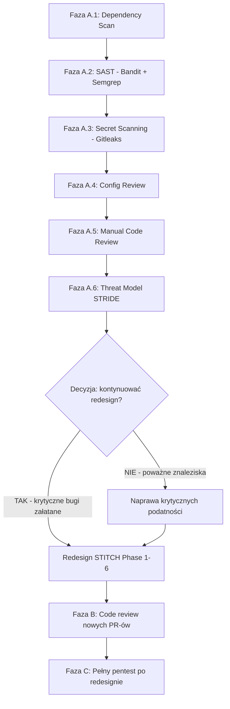

# SECURITY AUDIT PLAN — SPORT Platform v0.2.0-rc.1

> **Status**: Plan / Rekomendacja  
> **Data**: 2026-05-06  
> **Kontekst**: Pytanie — czy przed redesignem STITCH aplikacji mobilnej warto zrobić pentest?  
> **Decyzja**: NIE pełny pentest. TAK — lekki audyt bezpieczeństwa w 3 fazach.

---

## Executive Summary

**Pytanie**: Czy przed redesignem STITCH (18+ nowych ekranów mobilnych) warto zrobić pentest całego projektu?

**Odpowiedź**: Pełny, formalny pentest (black-box/grey-box) **przed** redesignem jest nieoptymalny — redesign doda ~40% nowego kodu i nowych endpointów API, których pentest by nie objął. Rekomendowane jest podejście 3-fazowe:

| Faza | Timing | Zakres | Typ |
|:-----|:-------|:-------|:----|
| **A** | PRZED redesignem | Lekki audyt rdzenia (SAST, deps, secrets, config review) | Statyczny |
| **B** | W TRAKCIE redesignu (Phase 1-2) | Security code review nowych komponentów | Manualny |
| **C** | PO redesignie (Phase 6 complete) | Pełny pentest całej platformy | Dynamiczny + Mobilny |

---

## Faza A: Lekki Audyt Rdzenia (PRZED redesignem)

**Cel**: Wykrycie krytycznych podatności w fundamencie, zanim redesign je odziedziczy.  
**Metoda**: Wyłącznie statyczna analiza kodu źródłowego — zero ryzyka dla produkcji.  
**Wymagane od Ciebie**: NIC — cały kod jest już w workspace.  
**Szacowany czas wykonania**: ~2-4h pracy narzędzi + manualnej analizy.

### A.1 — Dependency Vulnerability Scan

Skanowanie znanych CVE w zależnościach wszystkich trzech komponentów.

| Komponent | Narzędzie | Komenda |
|:----------|:----------|:--------|
| Backend (Python) | `pip-audit` | `pip install pip-audit && pip-audit -r backend/requirements.txt` |
| Mobile (Node.js) | `npm audit` | `npm audit --prefix mobile` |
| Admin (Node.js) | `npm audit` | `npm audit --prefix admin` |

**Oczekiwany wynik**: Lista pakietów z podatnościami + rekomendowane wersje do aktualizacji.

---

### A.2 — SAST (Static Application Security Testing)

Automatyczna analiza kodu pod kątem wzorców podatności (OWASP Top 10).

| Narzędzie | Język | Instalacja | Komenda |
|:----------|:------|:-----------|:--------|
| **Bandit** | Python | `pip install bandit` | `bandit -r backend/ -f json -o reports/bandit_report.json` |
| **Semgrep** | Python, TS, YAML, Dockerfile | `pip install semgrep` | `semgrep --config=auto backend/ mobile/ admin/` |
| **ESLint Security** | TypeScript/React | `npm install -D eslint-plugin-security` | `npx eslint --rule 'security/detect-*: error' admin/src/ mobile/src/` |

**Sprawdzane podatności (Bandit)**:
- `B101`: `assert` użyty w produkcji
- `B102`: `exec` / `eval`
- `B103-B105`: Hardcoded passwords/secrets
- `B301-B303`: Pickle, marshal, yaml.load (unsafe deserialization)
- `B501-B506`: Brak walidacji SSL/TLS, słabe szyfrowanie
- `B601-B611`: SQL injection przez string formatting
- `B701`: Jinja2 autoescape=False

**Sprawdzane podatności (Semgrep)**:
- Reguły OWASP Top 10 dla Python/Django
- Reguły dla TypeScript/React (XSS, eval, dangerouslySetInnerHTML)
- Reguły dla Dockerfile (root user, exposed ports)
- Reguły dla YAML (Kubernetes security context)

---

### A.3 — Secret Scanning

Wykrywanie kluczy API, tokenów, haseł zakodowanych w repo i historii gita.

| Narzędzie | Instalacja | Komenda |
|:----------|:-----------|:--------|
| **Gitleaks** | `go install github.com/gitleaks/gitleaks/v8@latest` (lub binary z GitHub Releases) | `gitleaks detect --source . --report-path reports/gitleaks_report.json` |
| **detect-secrets** (alternatywa) | `pip install detect-secrets` | `detect-secrets scan --all-files > reports/detect_secrets.json` |

**Co szuka**:
- Klucze API (OpenAI, Stripe, SendGrid, Garmin, Strava)
- JWT_SECRET / SECRET_KEY
- Database connection strings
- Tokeny OAuth
- Hasła w kodzie źródłowym

---

### A.4 — Manualna Weryfikacja Konfiguracji

Przegląd kluczowych plików konfiguracyjnych pod kątem bezpieczeństwa produkcji.

| Plik | Punkty kontrolne |
|:-----|:-----------------|
| [`backend/core/settings.py`](../backend/core/settings.py) | `SECRET_KEY`, `DEBUG`, `ALLOWED_HOSTS`, `CORS_ALLOW_ALL_ORIGINS`, `AUTH_PASSWORD_VALIDATORS`, brak `CommonPasswordValidator` |
| [`docker-compose.yml`](../docker-compose.yml) | Exposed ports, env vars, volumes, network mode, privileged mode |
| [`docker-compose.prod.yml`](../docker-compose.prod.yml) | Production hardening, secrets management, resource limits |
| [`backend/Dockerfile`](../backend/Dockerfile) | Base image, USER (root?), multi-stage build, healthcheck |
| [`admin/nginx.conf`](../admin/nginx.conf) | Security headers (HSTS, CSP, X-Frame-Options), TLS config |
| [`eas.json`](../eas.json) | Expo build config, environment variables, channel security |
| [`skaffold.yaml`](../skaffold.yaml) | Kubernetes deployment security context |

**Znane już słabości do weryfikacji**:
- [`CORS_ALLOW_ALL_ORIGINS = True`](../backend/core/settings.py#L146) — powinno być zawężone do konkretnych domen
- [`SECRET_KEY` z domyślną wartością](../backend/core/settings.py#L11) — ryzyko w produkcji
- [`CommonPasswordValidator` zakomentowany](../backend/core/settings.py#L95)
- Brak widocznego rate limiting / throttlingu w REST framework
- Brak `SECURE_SSL_REDIRECT`, `SECURE_HSTS_SECONDS` w settings

---

### A.5 — Manualny Code Review Krytycznych Ścieżek

Ręczny przegląd kodu pod kątem specyficznych podatności biznesowych.

| Ścieżka | Pliki | Sprawdzane podatności |
|:--------|:------|:----------------------|
| **Auth & JWT** | [`backend/core/settings.py`](../backend/core/settings.py#L121-L129), `backend/users/` | Token lifetime, refresh rotation, blacklist, password reset flow |
| **RLS Policies** | [`backend/core/rls.py`](../backend/core/rls.py), [`backend/activities/migrations/`](../backend/activities/migrations/) | Poprawność izolacji tenantów, brak privilege escalation |
| **API Endpoints** | [`backend/activities/views.py`](../backend/activities/views.py), [`backend/activities/urls.py`](../backend/activities/urls.py) | IDOR, brak autoryzacji, mass assignment, brak walidacji inputu |
| **Payments (Stripe)** | [`backend/rewards/stripe_service.py`](../backend/rewards/stripe_service.py), [`backend/activities/payments.py`](../backend/activities/payments.py) | Webhook signature verification, idempotency, race conditions |
| **Wearable OAuth** | [`backend/activities/wearables.py`](../backend/activities/wearables.py) | Token storage, refresh flow, CSRF w OAuth callback |
| **LLM Proxy** | `backend/activities/llm_proxy.py` (jeśli istnieje) | API key exposure, prompt injection, rate limiting |
| **GPS Tracking** | [`mobile/src/services/GpsSyncManager.ts`](../mobile/src/services/GpsSyncManager.ts) | Location data privacy, local storage, sync security |
| **Mobile API Client** | [`mobile/src/services/api.ts`](../mobile/src/services/api.ts) | Token storage (SecureStore vs AsyncStorage), timeout, SSL pinning |

---

### A.6 — Threat Model (STRIDE)

Dokumentacja modelu zagrożeń dla krytycznych przepływów danych.

| Flow | Spoofing | Tampering | Repudiation | Info Disclosure | DoS | Elevation |
|:-----|:---------|:----------|:------------|:----------------|:----|:----------|
| GPS → Backend | JWT forgery | GPS spoofing | Brak audytu | Location leak | Flood endpoint | — |
| OAuth (Strava/Garmin) | Fake callback | Token interception | — | Token leak in logs | — | — |
| Payments (Stripe) | Fake webhook | Price tampering | — | Key exposure | — | — |
| LLM Proxy | — | Prompt injection | — | API key leak | API abuse | — |
| RLS Policies | Tenant impersonation | — | — | Cross-tenant data leak | — | Privilege escalation |

---

## Faza B: Security Code Review (W TRAKCIE redesignu)

**Cel**: Nie dopuścić do wprowadzenia nowych podatności podczas redesignu STITCH.

**Timing**: Podczas implementacji Phase 1 i Phase 2 STITCH (nowe ekrany + endpointy).

| Nowy komponent | Co review'ować |
|:---------------|:---------------|
| `ActivityDetailScreen` | Nowy endpoint `/api/activities/<id>/` — IDOR, autoryzacja |
| `CityHubScreen` | Nowy endpoint city stats — cache poisoning, data leak |
| `GlobalLeaderboardScreen` | Leaderboard query — SQL injection, DoS przy dużych datasetach |
| `SettingsScreen` | Nowy endpoint user settings — mass assignment |
| `ClubsDirectoryScreen` | Nowy endpoint clubs — privilege escalation |
| Nowy Bottom Tab Bar | Client-side routing — deep link hijacking |

**Metoda**: Review diff-a PR przed mergem. Używanie Semgrep CI/CD (GitHub Actions) do automatycznego skanowania każdego PR.

---

## Faza C: Pełny Pentest (PO redesignie)

**Cel**: Kompleksowe testy bezpieczeństwa całej platformy po zakończeniu redesignu STITCH (Phase 6).

**Timing**: Po zakończeniu implementacji wszystkich 18+ ekranów.

**Wymagane od Ciebie**:
1. Lokalny stack Docker (`docker-compose up --build -d`)
2. Plik APK zbudowany (`eas build --platform android --profile preview --local`)

---

### C.1 — DAST (Dynamic Application Security Testing)

| Narzędzie | Instalacja | Co testuje |
|:----------|:-----------|:-----------|
| **sqlmap** | `pip install sqlmap` | SQL Injection we wszystkich endpointach z parametrami |
| **OWASP ZAP** (headless) | `docker pull owasp/zap2docker-stable` | Pełny skan OWASP Top 10 (XSS, CSRF, IDOR, misconfig) |
| **Python fuzzing scripts** | `pip install requests` | Niestandardowe payloady, boundary testing, rate limiting |

**Komendy**:
```bash
# ZAP Baseline Scan
docker run -v $(pwd):/zap/wrk owasp/zap2docker-stable zap-baseline.py \
  -t http://host.docker.internal:8000/api/ \
  -r reports/zap_baseline_report.html

# ZAP Full Scan (wymaga więcej czasu)
docker run -v $(pwd):/zap/wrk owasp/zap2docker-stable zap-full-scan.py \
  -t http://host.docker.internal:8000/api/ \
  -r reports/zap_full_report.html

# sqlmap — test endpointów GET z parametrami
sqlmap -u "http://localhost:8000/api/activities/leaderboard/1/" --batch --random-agent

# sqlmap — test POST login
sqlmap -u "http://localhost:8000/api/auth/token/" --data="username=test&password=test" --batch
```

---

### C.2 — Container Scanning

| Narzędzie | Instalacja | Komenda |
|:----------|:-----------|:--------|
| **hadolint** | `docker pull hadolint/hadolint` | `hadolint backend/Dockerfile admin/Dockerfile` |
| **checkov** | `pip install checkov` | `checkov -d . --framework dockerfile` |
| **Trivy** | `docker pull aquasec/trivy` | `docker run --rm -v /var/run/docker.sock:/var/run/docker.sock aquasec/trivy image sport-backend:latest` |

---

### C.3 — Mobile Reverse Engineering (OWASP MASVS)

| Narzędzie | Instalacja | Co sprawdza |
|:----------|:-----------|:------------|
| **apktool** | `docker pull razzk/apktool` (lub wymaga Java JRE 8+) | Dekompilacja APK → AndroidManifest.xml, resources |
| **jadx** | `docker pull jadx/jadx` | Dekompilacja bytecode → Java/Kotlin źródło |
| **MobSF** | `docker pull opensecurity/mobile-security-framework-mobsf` | Automatyczny skan OWASP MASVS |

**Komendy**:
```bash
# Dekompilacja APK
apktool d mobile/build/outputs/apk/release/app-release.apk -o reports/apktool_output/

# Analiza MobSF (wymaga uruchomionego kontenera)
docker run -it -p 8000:8000 opensecurity/mobile-security-framework-mobsf
# Następnie upload APK przez web UI na localhost:8000
```

**Sprawdzane aspekty MASVS**:
- `MASVS-STORAGE-1`: Czy dane wrażliwe (tokeny JWT, GPS) są w SecureStore/Keystore, nie w AsyncStorage?
- `MASVS-STORAGE-2`: Czy backup jest wyłączony w AndroidManifest? (`android:allowBackup="false"`)
- `MASVS-NETWORK-1`: Czy jest certificate pinning?
- `MASVS-NETWORK-2`: Czy wszystkie requesty idą przez HTTPS?
- `MASVS-CODE-1`: Czy kod nie zawiera hardcoded secrets?
- `MASVS-CODE-2`: Czy WebView są bezpiecznie skonfigurowane?
- `MASVS-RESILIENCE-1`: Czy aplikacja wykrywa root/jailbreak?
- `MASVS-RESILIENCE-2`: Czy jest obfuskacja kodu (ProGuard/R8)?

---

### C.4 — Infrastruktura i Sieć

| Narzędzie | Komenda |
|:----------|:--------|
| **nmap** | `nmap -sV -p- localhost` (skanowanie portów Docker) |
| **docker bench security** | `docker run --rm --pid host --userns host --net host --cap-add audit_control -v /var/lib:/var/lib -v /var/run/docker.sock:/var/run/docker.sock docker/docker-bench-security` |

---

## Podsumowanie: Co potrzebujesz zrobić, żeby umożliwić każdy typ testu

| Test | Twoje działanie | Koszt czasowy |
|:-----|:----------------|:--------------|
| **Faza A (SAST, deps, secrets, config)** | NIC — kod już jest w workspace | 0 min |
| **Faza B (code review)** | NIC — review diff-ów PR | 0 min |
| **DAST (sqlmap, ZAP, fuzzing)** | `docker-compose up --build -d` | ~5 min |
| **Container scanning (hadolint, Trivy)** | `docker-compose build` | ~3 min |
| **Mobile reverse engineering (APK)** | `cd mobile && eas build --platform android --profile preview --local` | ~15 min |
| **Infrastruktura (nmap)** | `docker-compose up` (już zrobione dla DAST) | 0 min |

---

## Rekomendowana kolejność wykonania



---

## Następne kroki

1. **Decyzja**: Czy przechodzimy do Fazy A teraz (static analysis)?
2. **Switch do Code mode**: Instalacja narzędzi i uruchomienie skanów.
3. **Raport**: Wszystkie wyniki zapisane w `reports/` z klasyfikacją Critical/High/Medium/Low.

---

*Dokument wygenerowany na podstawie analizy kodu źródłowego, [`designmobile.md`](../docs/designmobile.md), [`CHARTER.md`](../docs/CHARTER.md), [`HANDOVER.md`](../HANDOVER.md), [`settings.py`](../backend/core/settings.py).*
